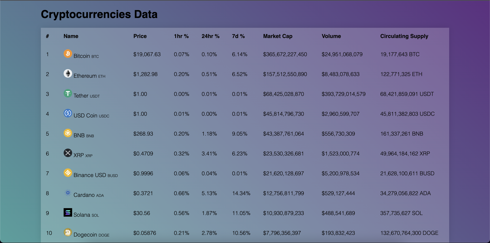

The scraper project has two directories: `backend` built using Django and `frontend` built using React.

Backend Commands Used
---
- cd backend/
- `python3 -m venv env` # Creating virtual environment 
- `python -m pip install django` # Installing Django
- `python -m pip freeze > requirements.txt` # Creating requirements file
- `django-admin startproject scraper .` # Created Djngo Project
- `python manage.py makemigrations`
- `python manage.py migrate`
- `python manage.py runserver`

For update of crypto prices after every 5 sec I have implemented task queue with `redis` and task worker using `celery`. To send task to task queue from django i have used `celery-beat`. 
Run following commands in terminal to start services:
    - redis-server
    - celery -A scraper.celery worker --pool=solo -l info
    - celery -A scraper beat -l INFO

Created Django Rest API to read data from database and serializer to send JSON data to frontend.

Frontend Commands
---
- cd frontend/crypto-app
- npm install
- npm start
- open localhost:3000/ in browser.

*Note* - For CORS issue please use (`Allow CORS Extension`)[https://chrome.google.com/webstore/detail/allow-cors-access-control/lhobafahddgcelffkeicbaginigeejlf?hl=en]